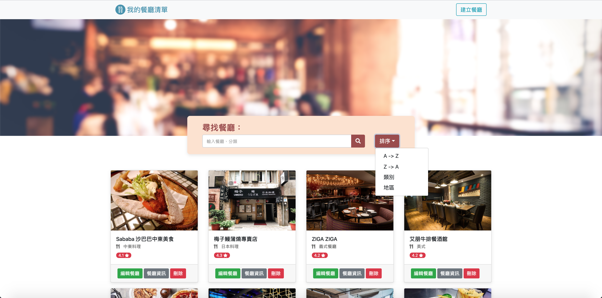
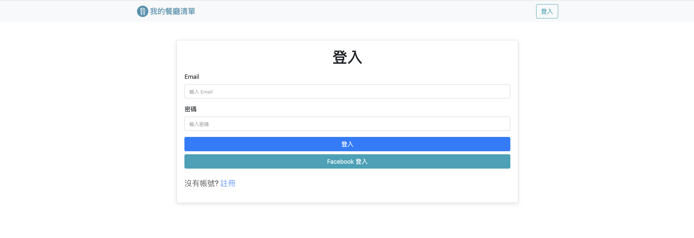
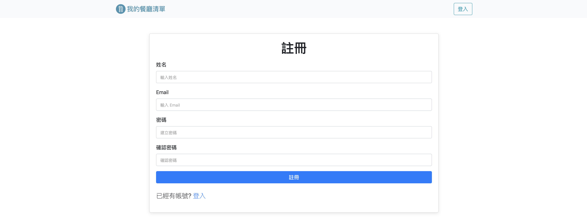

# 餐廳清單

##### 使用者可以建立屬於自己餐廳清單，可以新增、修改、刪除餐廳清單

## Installing

#### NPM的使用

```
- node.js v-10.15.0
- nodemon
- Express
- Express-Handlebars
- body-parser
- Mongoose
- method-override
- passport
- passport-local
- passport-facebook
- express-session
- bcryptjs
- dotenv
- connect-flash
```

##### 確認本機是否安裝 [Mongodb](https://www.mongodb.com/download-center/community) 、 [Robo 3T](https://robomongo.org/)

##### 1.開啟終端機到存放專案本機位置並執行:

`git clone https://github.com/henry22/restaurant_list_with_CRUD`

##### 2.初始設定

```
1.切換目錄到專案: cd restaurant_list_with_CRUD
2.安裝套件: npm install
3.新增種子資料 
-終端機上執行 npm run seed
- 確認 Robo 3T 資料已經建立了
```

##### 3.執行程式

```
1. 終端機輸入: nodemon run dev
2. 開啟網頁輸入: http://localhost:3000
```

## 主要功能

##### 1. 使用者可以新增一家餐廳

##### 2. 使用者可以瀏覽一家餐廳的詳細資訊

##### 3. 使用者可以瀏覽全部所有餐廳

##### 4. 使用者可以修改一家餐廳的資訊

##### 5. 使用者可以刪除一家餐廳

##### 6. 使用者可以使用下拉式選單排序餐廳

##### 7. 使用者可以使用臉書帳號登入

##### 8. 使用者必須登入才能使用餐廳清單，如果沒登入，會被導向登入頁面

##### 9. 使用者可以註冊帳號，註冊的資料包括：名字、email、密碼、確認密碼。其中 email 與密碼是必填欄位，但名字不是

##### 10. 如果使用者已經註冊過、沒填寫必填欄位、或是密碼輸入錯誤，就註冊失敗，並回應給使用者錯誤訊息

##### 11. 登入後，使用者可以建立並管理專屬他的一個餐廳清單

##### 12. 使用者登出、註冊失敗、或登入失敗時，使用者都會在畫面上看到正確而清楚的系統訊息

## 截圖

###### 1.首頁


###### 2.餐廳詳細資料


###### 3.新增餐廳


###### 4.刪除餐廳


###### 5.新增排序功能



###### 6.新增登入頁面



###### 7.新增註冊頁面

