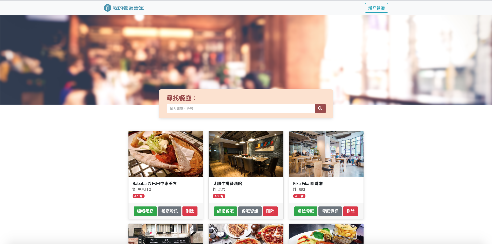
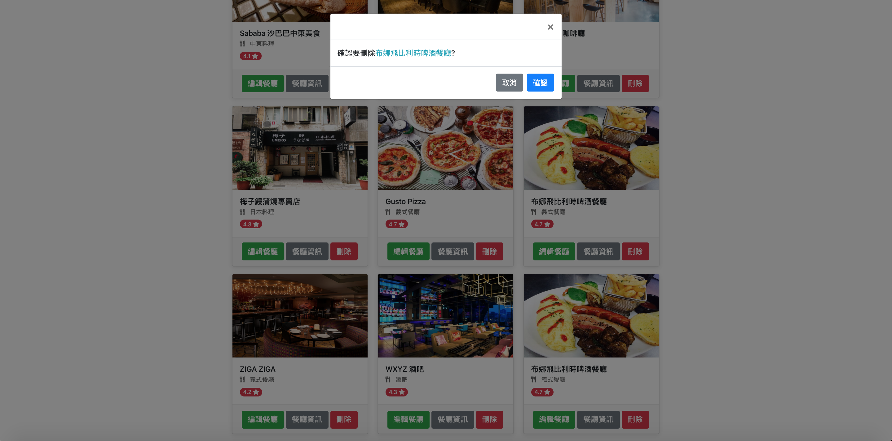

# 餐廳清單

##### 使用者可以建立屬於自己餐廳清單，可以新增、修改、刪除餐廳清單

## Installing

#### NPM的使用

```
- node.js v-10.15.0
- nodemon
- Express
- Express-Handlebars
- body-parser
- Mongoose
- method-override

```

##### 確認本機是否安裝 [Mongodb](https://www.mongodb.com/download-center/community) 、 [Robo 3T](https://robomongo.org/)

##### 1.開啟終端機到存放專案本機位置並執行:

`git clone https://github.com/henry22/restaurant_list_with_CRUD`

##### 2.初始設定

```
1.切換目錄到專案: cd restaurant_list_with_CRUD
2.安裝套件: npm install
3.新增種子資料 -終端機上執行 restaurantSeeder.js
- cd ~ models\seeds
- node restaurantSeeder.js
- 確認 Robo 3T 資料已經建立了
```

##### 3.執行程式

```
1. 終端機輸入: nodemon run dev
2. 開啟網頁輸入: http://localhost:3000
```

## 主要功能

##### 1. 使用者可以新增一家餐廳

##### 2. 使用者可以瀏覽一家餐廳的詳細資訊

##### 3. 使用者可以瀏覽全部所有餐廳

##### 4. 使用者可以修改一家餐廳的資訊

##### 5. 使用者可以刪除一家餐廳

## 截圖

###### 1.首頁



###### 2.餐廳詳細資料


###### 3.新增餐廳


###### 4.刪除餐廳

